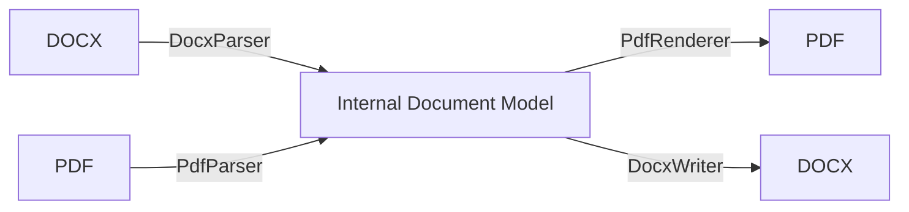

<div align="center">
  <h1>Multi-Format Converter</h1>
  <p><b>Offline DOCX <-> PDF conversion on Android, powered by a clean Internal Document Model (IDM).</b></p>
  <p>Fast, private, and fully on-device - no servers, no uploads, no tracking.</p>
  
  
</div>

<div align="center">


</div>

---

## 🚀 Overview
Multi-Format Converter is an **offline Android application** that converts **DOCX <-> PDF** using a dedicated **Internal Document Model (IDM)**. It prioritizes structural correctness (paragraphs, styles, spacing) while keeping everything **on device** for privacy and speed.

> **Why this project matters**
> - Many converters send documents to the cloud. This one never does.
> - Perfect for resumes, reports, and sensitive documents.
> - Designed for low-connectivity or offline-only environments.

---

## ✨ Key Features
- **Offline-only conversion** (no network calls)
- **DOCX <-> PDF** support with a unified IDM pipeline
- **Style preservation**: font size, bold/italic, spacing, alignment
- **Modern Android UI** with file picker, progress, and share flow
- **Safe streaming pipeline** to avoid large memory spikes
- **Built-in progress tracking** and conversion warnings

---

## 🧠 How It Works
The engine never converts formats directly. Instead, it normalizes content into an **Internal Document Model** and then renders the target format.



---

## 🏗️ Architecture
- **Format-agnostic core** using IDM (Document -> Page -> Paragraph -> TextRun)
- **Pluggable parsers/renderers** for future formats
- **Streaming-first** design to keep memory usage predictable

> Full architecture spec: [docs/ARCHITECTURE.md](docs/ARCHITECTURE.md)

---

## 🛠️ Tech Stack

| Layer | Tech |
|------|------|
| Android |  |
| Language |  |
| Build |  |
| PDF Parsing |  |
| UI |  |

---

## 📸 Demo / Screenshots

**App Flow (GIF placeholder)**


> Screenshots are not available yet. Replace the placeholders below when ready.

| Home | Conversion | Result |
|------|------------|--------|
|  |  |  |

---

## ⚙️ Installation Guide

### Prerequisites
- Android Studio (latest stable)
- JDK 17
- Android SDK Platform 34

### Build Steps
```bash
# Clone the repository
https://github.com/TharunBabu-05/Multi_format_converter_android.git

# Open in Android Studio
# Sync Gradle and run the app
```

### Build from CLI
```bash
# Windows
./gradlew.bat assembleDebug

# macOS / Linux
./gradlew assembleDebug
```

---

## ▶️ Usage Instructions
1. Launch the app.
2. Tap **Select File** and choose a DOCX or PDF.
3. Tap **Convert**.
4. Save the output and open/share instantly.

---

## 📂 Project Structure
```
Multi_format_converter/
|-- app/
|   |-- src/main/
|   |   |-- java/com/converter/
|   |   |   |-- core/           # IDM + conversion engine
|   |   |   |-- parser/         # DOCX/PDF parsers
|   |   |   |-- renderer/       # DOCX/PDF renderers
|   |   |   |-- infrastructure/ # progress, temp files, errors
|   |   |   `-- ui/             # activities + viewmodels
|   |   `-- res/                # layouts, strings, icons
|   `-- build.gradle.kts
|-- docs/
|   `-- ARCHITECTURE.md
|-- build.gradle.kts
|-- settings.gradle.kts
`-- gradlew.bat
```

---

## 🔌 API / Modules
- **Core Engine**: `ConversionEngine` orchestrates parsing -> layout -> render.
- **Parsers**: `DocxParser`, `PdfParser` build IDM from source formats.
- **Renderers**: `PdfRenderer`, `DocxWriter` emit target formats.
- **Infrastructure**: progress reporting, temp file management, error handling.

---

## 📊 Performance / Benchmarks

| Device | Conversion | Pages | Time | Notes |
|--------|------------|------:|-----:|------|
| Example (replace) | DOCX -> PDF | 3 | 1.2s | Mid-range phone |
| Example (replace) | PDF -> DOCX | 2 | 1.6s | Layout heavy |

> Replace the example rows with real timings from your device.

---

## 🧪 Future Improvements / Roadmap
- Image embedding and extraction
- Table structure support
- Advanced font mapping and color fidelity
- Improved multi-column layout detection
- OCR pipeline for scanned PDFs

---

## 🧩 Real-World Applications
- Resume and portfolio conversion
- Academic submissions (PDF <-> DOCX)
- Offline document workflows in restricted environments
- On-device privacy-preserving document editing

---

## 🧲 Recruiter-Friendly Highlights
- Strong separation of concerns (parsers, IDM, renderers)
- Kotlin + Coroutines for non-blocking IO
- Android-native PDF generation (Canvas/PdfDocument)
- Streaming-first memory strategy

---

## ⚖️ Comparison (Why Not Use Cloud Converters?)

| Capability | This Project | Typical Cloud Tools |
|-----------|--------------|---------------------|
| Offline | ✅ | ❌ |
| Privacy | ✅ | ❌ |
| Android‑native | ✅ | ❌ |
| No Watermarks | ✅ | ⚠️ Often paid |
| Extensible Architecture | ✅ | ❌ |

---

## 🤝 Contributing Guidelines
1. Fork the repo
2. Create a feature branch
3. Commit with clear messages
4. Submit a PR with details and screenshots

---

## 📜 License
MIT License. See [LICENSE](LICENSE).

---

## 🙌 Acknowledgements
- PdfBox-Android
- AndroidX + Material Components
- Kotlin + Coroutines

---

## 📬 Contact / Author
Created by **Tharun Babu**
- GitHub: https://github.com/TharunBabu-05

---

## 📈 GitHub Stats (placeholders)


---

> Want a custom banner and demo GIFs? Drop them into an `assets/` folder and update the links above.
